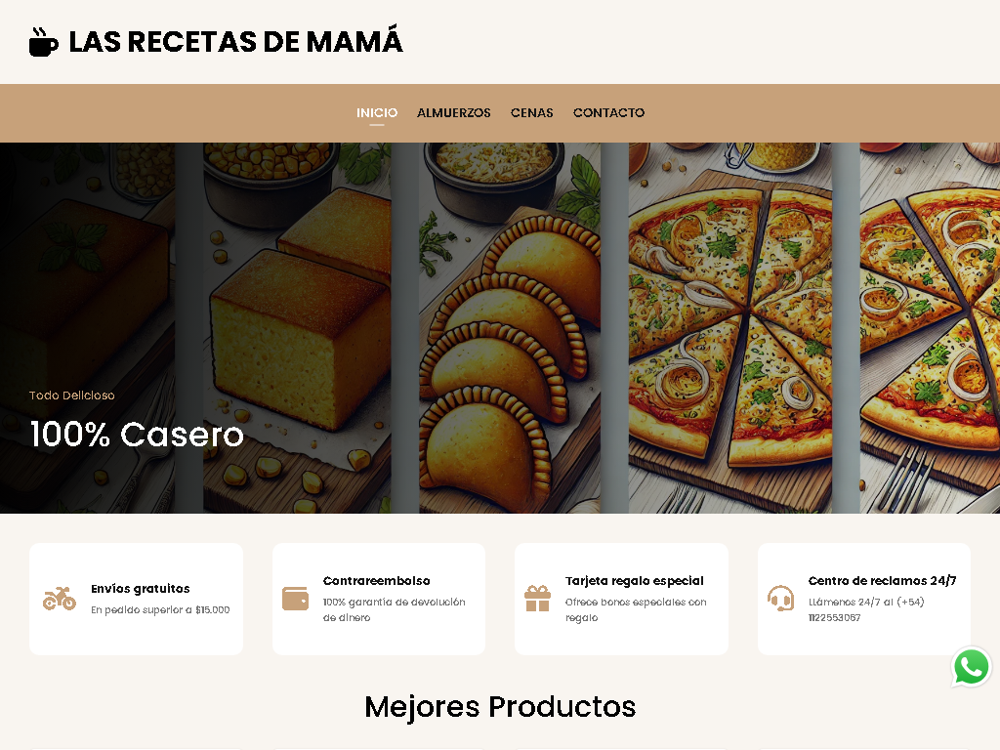
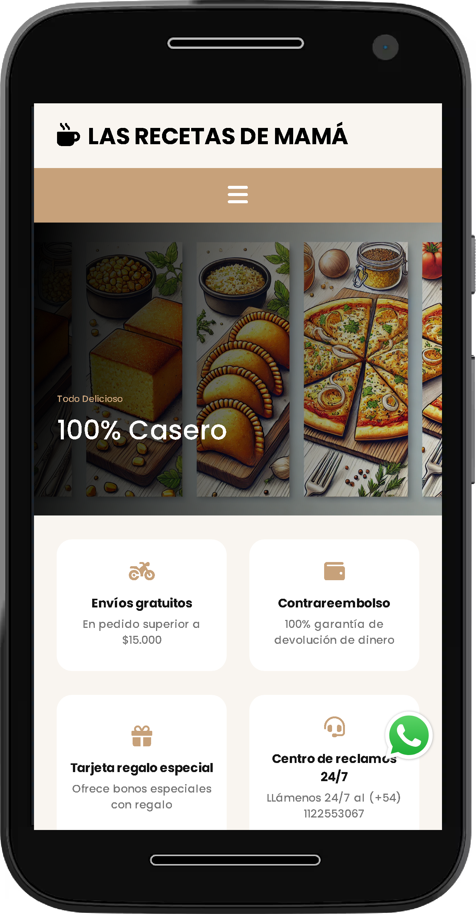

# 🥘 Las recetas de mamá

¡Bienvenido al repositorio del sitio web **Las recetas de mamá**! Aquí encontrarás el código fuente y todos los detalles de este proyecto.

## 📖 Descripción

Este proyecto es un sitio web de venta de comida casera desarrollado con tecnologías **HTML**, **CSS**, y **JavaScript**. El objetivo es crear una interfaz atractiva y fácil de usar para que los usuarios puedan explorar y comprar comidas caseras con una navegación intuitiva y diseño adaptable.

---

## 🖥️ Vista en Versión Desktop

La interfaz en su versión para escritorio está diseñada para maximizar la visualización del contenido, con un enfoque en la presentación de imágenes y detalles de cada comida:

---

## 📱 Vista en Versión Mobile

En la versión móvil, la prioridad está en la accesibilidad y usabilidad para dispositivos con pantallas pequeñas. Los elementos se reorganizan para que la navegación siga siendo fluida:

---

## 📱 Vista del Menú Mobile

El menú en la versión móvil está diseñado para ser accesible y fácil de usar, asegurando que los usuarios puedan navegar por las distintas secciones del sitio sin complicaciones. Se implementa un menú hamburguesa que, al hacer click, despliega opciones claramente etiquetadas. Además, se ha optimizado para que las opciones sean legibles y fáciles de seleccionar incluso en pantallas pequeñas.

---

## 🚀 Enlace a la Aplicación

Accede al proyecto haciendo click en el siguiente enlace:

- **[Las recetas de mamá](https://lasrecetasdemama2024.netlify.app//)**

---

## 🛠️ Tecnologías Utilizadas

Este proyecto fue construido utilizando:

- **HTML5** - Estructura del contenido.
- **CSS3** - Diseño visual y responsividad.
- **JavaScript** - Funcionalidad interactiva y dinámica.
